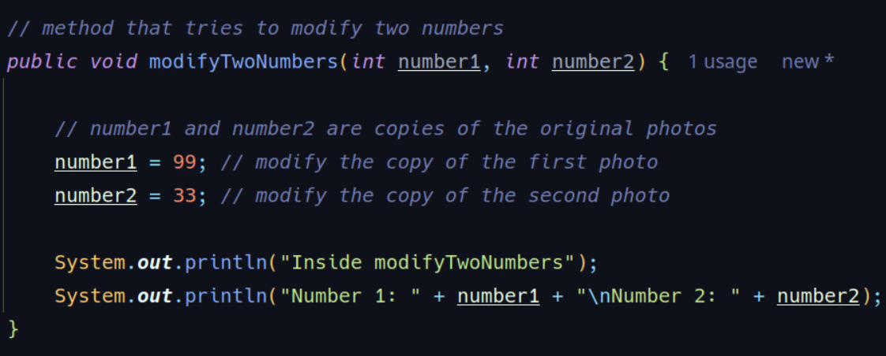
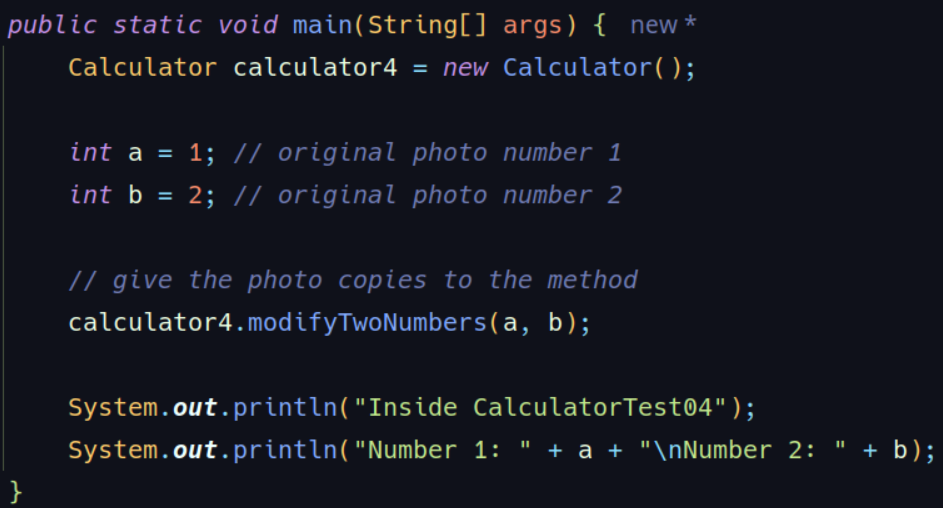

### PRIMITIVE TYPE PARAMETERS

**Metaphor: Photographs and Frames**

Imagine you have a special photo (the original variable) that is in a frame in your house.  
When you want to show this photograph to someone, instead of giving them the original frame, you take a 
*copy of the photograph* and hand over that copy. The person can do whatever they want with the copy 
(draw on it, tear it, modify it), but the original photograph in its frame remains untouched.

__How it works with the metaphor__

1. __Original photos in frames:__

- The variables *a* and *b* in the *main* method represent the __original photos__ in their frames.
- These are the original values you want to protect (a = 1 and b = 2).

2. __Copies of the photos:__

- When you call *modifyTwoNumbers(a, b)*, the values of *a* and *b* are __copied__ into the parameters
*number1* and *number2* of the method.
- These parameters (number1 and number2) are __independent copies__ of the original photos.

3. __Modifications inside the method__

- Inside the method *modifyTwoNumbers*, the copies (number1 and number2) are modified (number1 = 99 and number2 = 33).
- However, these changes only affect the __copies__ and not the original photos (a and b).

4. __Original photos remain unchanged:__

- After the method finishes execution, the original variables *a* and *b* in the *main* method remain unchanged
because the method only worked with the copies.

__Why does this happen?__

In Java, primitive types (like int, double, boolean, etc.) are always passed by value. This means that when you 
pass a variable to a method, Java creates a copy of the value and gives it to the method. The method works with 
the copy, not the original variable.

