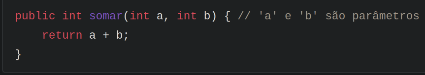
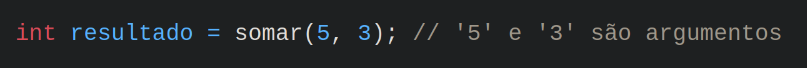

PARÂMETRO X ARGUMENTO

Parâmetro

Um parâmetro é uma variável declarada na definição de um método. Ele serve como um "espaço reservado"
para um valor que será passado para o método quando ele for chamado.

- Onde encontrado: Na declaração do método
- Propósito: Define o tipo e o nome dos dados que o método espera receber.

No exemplo, 'a' e 'b' são parâmetros do método *somar*. Eles indicam que o método
espera receber dois valores inteiros.

Argumento

Um argumento é o valor real que é passado para um método quando ele é chamado. É o dado concreto que 
preenche o "espaço reservado" do parâmetro.

- Onde encontrado: Na chamada do método.
- Propósito: Fornece os dados que o método precisa para executar suas operações.

No exemplo, 5 e 3 são argumentos passados para o método *somar*. O valor 5 é atribuído
ao parâmetro 'a', e o valor 3 é atribuído ao parâmetro 'b'.
