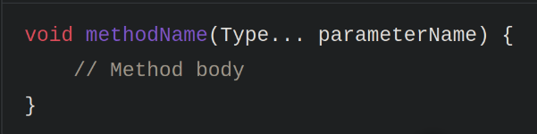
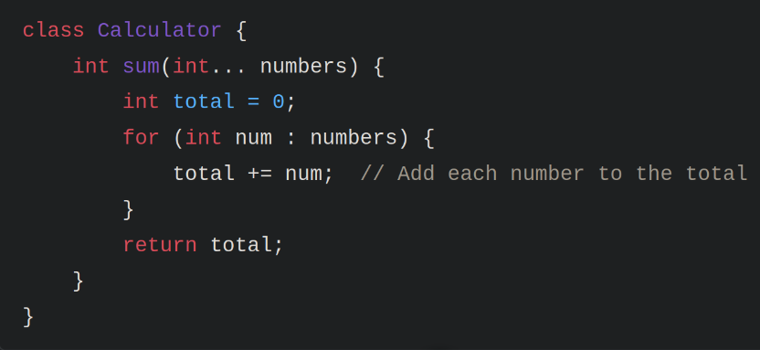
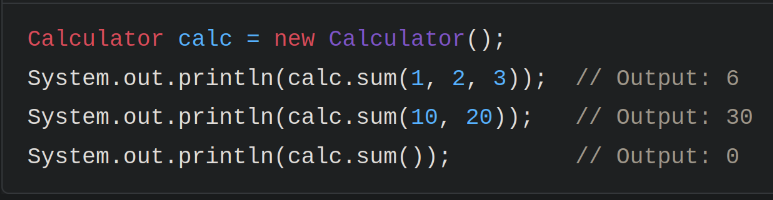
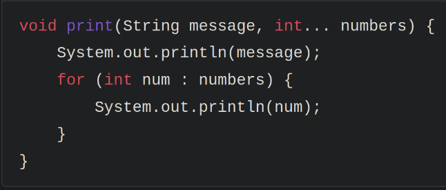

__PARÂMETRO X ARGUMENTO__

Parâmetro

Um parâmetro é uma variável declarada na definição de um método. Ele serve como um "espaço reservado"
para um valor que será passado para o método quando ele for chamado.

- Onde encontrado: Na declaração do método
- Propósito: Define o tipo e o nome dos dados que o método espera receber.

No exemplo, 'a' e 'b' são parâmetros do método *somar*. Eles indicam que o método
espera receber dois valores inteiros.

Argumento

Um argumento é o valor real que é passado para um método quando ele é chamado. É o dado concreto que 
preenche o "espaço reservado" do parâmetro.

- Onde encontrado: Na chamada do método.
- Propósito: Fornece os dados que o método precisa para executar suas operações.

No exemplo, 5 e 3 são argumentos passados para o método *somar*. O valor 5 é atribuído
ao parâmetro 'a', e o valor 3 é atribuído ao parâmetro 'b'.

__VARARGS__

What Are Varargs?

Varargs, short for variable-length arguments, allow you to pass an arbitrary number of arguments 
to a method. This is useful when you don’t know in advance how many arguments will be passed.

Syntax:
To use Varargs, you declare a method parameter with the type followed by three dots (...).

1. How Varargs Work

When you use Varargs, Java treats the arguments as an array. Inside the method, you can access
the arguments just like you would with an array.

Example:

Usage:

2. Rules for Using Varargs

Only One Varargs Parameter:
A method can have only one Varargs parameter.
If there are other parameters, the Varargs parameter must be the last one.

