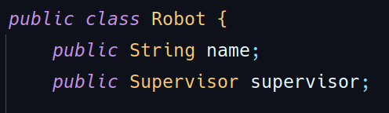
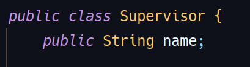
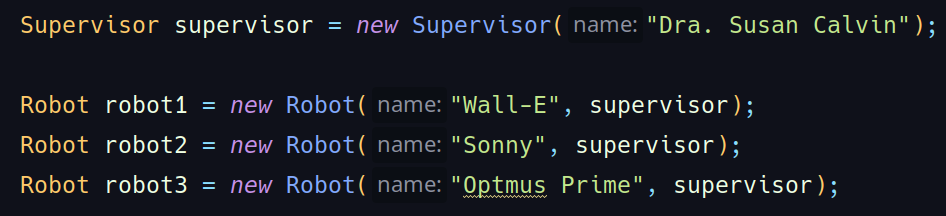

Na orientação a objetos, **associação unidirecional muitos-para-um** ocorre quando **muitos objetos de uma classe** estão associados a **um único objeto de outra classe,** mas essa relação só é conhecida por um dos lados. Ou seja, vários objetos “A” conhecem o mesmo objeto “B”, mas “B” não sabe quem são os “A” que o conhecem.

**Exemplo prático com robótica**

Imagine uma fábrica onde vários robôs trabalham sob a supervisão de um único supervisor. Cada robô sabe quem é seu supervisor, mas o supervisor não precisa saber (nem guardar referência) de todos os robôs que supervisiona.

**Modelando em JAVA:**

1. **Definindo as classes**

**Assossiação:**  Cada robô conhece seu supervisor.

2. **Criando e associando os objetos**

Agora, **três robôs diferentes** estão associados ao **mesmo supervisor.** Cada robô sabe quem é seu supervisor, mas o supervisor não tem uma lista dos robôs sob sua responsabilidade.

**Por que associar muitos-para-um?**
Esse tipo de associação é útil quando precisamos que cada objeto saiba a qual grupo, líder ou entidade ele pertence, mas o grupo/líder não precisa gerenciar ou conhecer todos os seus membros diretamente. Isso simplifica o relacionamento e reduz o acoplamento entre as classes.

**Diferença para outros tipos de associação**

- **Um-para-muitos:** Um objeto conhece vários outros (e.g.: Um supervisor conhece vários robôs).
- **Muitos-para-um:** Vários objetos conhecem o mesmo objeto (e.g.: vários robôs conhecem o mesmo supervisor).
- **Bidirecional:** Ambos os lados conhecem um ao outro (e.g.: supervisor conhece os robôs e os robôs conhecem supervisor).