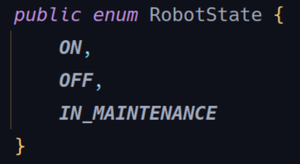
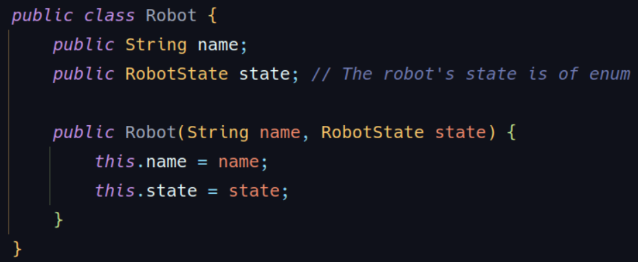
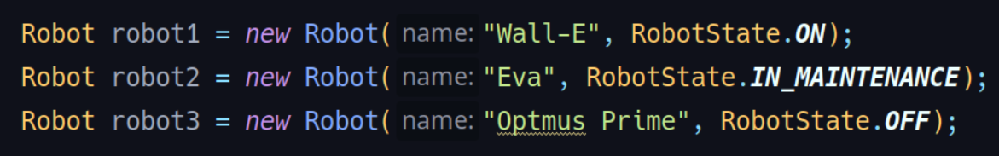
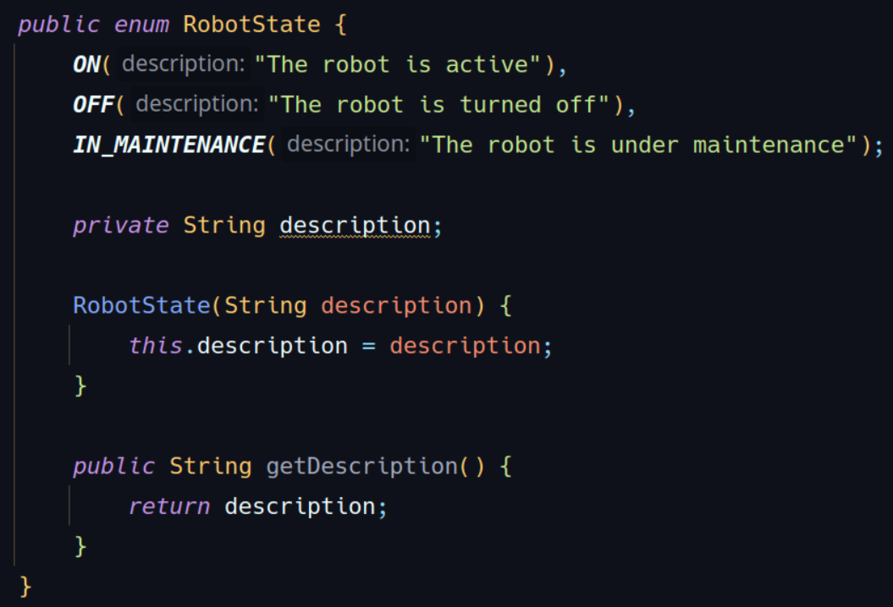
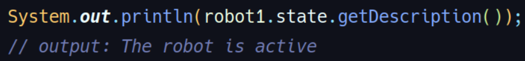
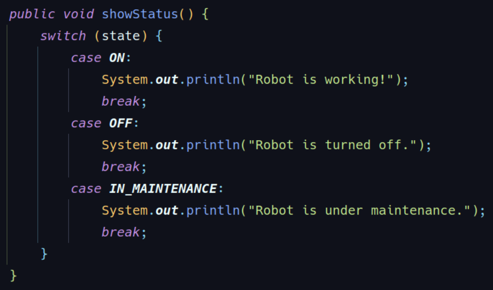
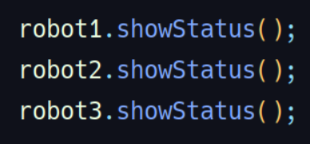
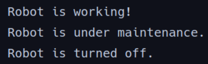

**O que é um enum?**

Imagine que precisamos criar um sistema para controlar robôs. Em vários
momentos, precisamos de variáveis que só podem ter alguns valores específicos.
Por exemplo:

- Um robô só pode estar **ligado, desligado** ou **em manutenção.**
- Um semáforo só pode estar **verde, amarelo** ou **vermelho.**

Poderíamos usar **strings** ou **números** para representar esses estados,
mas isso pode causar erros. Por exemplo, alguém pode digitar "ligadoo" com
dois "o" e o programa não vai entender.

O **enum** serve para resolver esse problema! Ele cria um **tipo especial
de variável** que só aceita valores pré-definidos. Assim, evitamos erros
e deixamos o código mais organizado.

**Exemplo básico:** 

- Aqui, _RobotState_ é um **enum** com três valores possíveis: **ON, OFF** e **MAINTANCE.**
- Não podemos inbentar outros valores para essa variável além de um desses três (a menos 
que esse novo valor seja criado direto no enum).

**Usando enum em uma classe:**

Agora, quando criarmos um robô, só podemos passar um dos valores do enum:

Se tentarmos passar qualquer valor diferente, o Java não deixa!

**Por que usar enum?**

- **Evita erros de digitação:** Não corremos o risco de escrever o estado errado
- **Mais seguro:** O Java só aceita os valores definidos no enum.
- **Mais organizado:** Fica fácil de entender quais são as opções possíveis para aquela variável

**O enum é ainda mais poderoso do que parece!**

Podemos adicionar **informações extras e métodos** ao enum. Por exemplo, podemos atribuir
uma descrição para cada estado:

Agora, podemos fazer:

**Usando enums em decisões switch:** 
Podemos usar enums em estruturas de decisão como _switch case_:

Chamando o método com o switch: 

Output: 

**Resumindo:**
- **Enum** é um tipo especial de variável que só aceita valores pré-definidos.
- Ajuda a evitar erros e deixa o código mais seguro e organizado.
- Muito útil para representar estados, tipos, comandos, dias da semana, etc.
- Pode ter métodos e informações extras.

