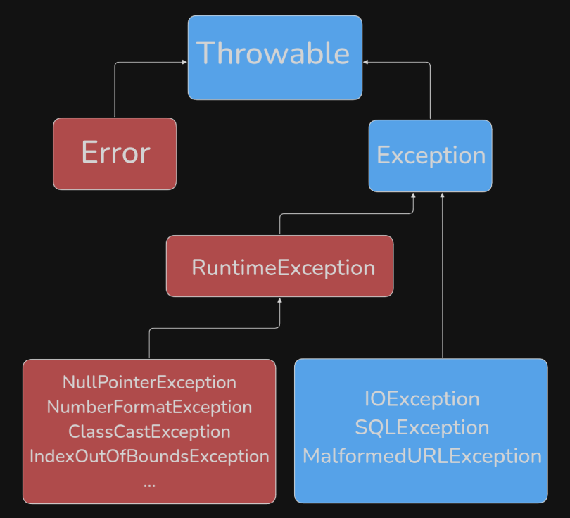
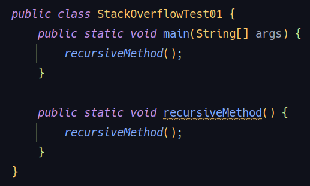
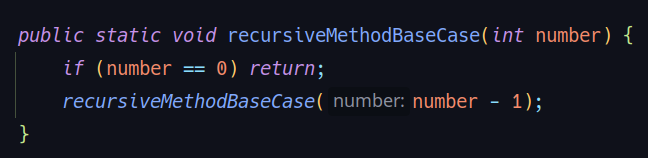

## Exceptions pt1 - Errors 


### O que são Exceções?
Exceções são condições anormais que ocorrem durante a execução de um programa, interrompendo o fluxo normal de instruções.

#### Hierarquia de Exceções em Java:
Tudo que pode ser "lançado" (thrown) em Java herda da classe Throwable.
Throwable tem duas subclasses principais:

**Error**: Representa problemas sérios que uma aplicação razoável não deveria tentar tratar. Geralmente são condições anormais que ocorrem na Java Virtual Machine (JVM) ou no ambiente de execução.

**Exception:** Representa condições que uma aplicação pode querer tratar. Estas são subdivididas em exceções checadas (checked exceptions) e não checadas (unchecked exceptions/runtime exceptions)

#### Error (Erro):
São situações das quais, na maioria das vezes, o programa não consegue se recuperar.
Quando um Error ocorre, a JVM geralmente para a execução do programa.

#### Exemplos de Error:
_OutOfMemoryError_: Ocorre quando a JVM não consegue alocar mais memória porque toda a memória disponível foi esgotada.

_StackOverflowError_: Ocorre quando a pilha de chamadas de métodos (call stack) excede seu limite de tamanho. Isso é comum em recursões infinitas ou muito profundas.

A solução para um _Error_ geralmente envolve corrigir o problema fundamental no código ou no ambiente (ex: aumentar a memória da JVM, corrigir uma recursão infinita) e reiniciar a aplicação. Não se espera que o programa trate esses erros em tempo de execução.

Demonstração Prática: StackOverflowError:
Um _StackOverflowError_ pode ocorrer criando um método recursivo simples que chama a si mesmo indefinidamente, sem uma condição de parada. Cada chamada de método é empilhada na "stack". Em uma recursão infinita, a pilha cresce até estourar a memória alocada para ela, resultando no _StackOverflowError_.
Uma vez que esse erro ocorre, não há muito o que o programa possa fazer para se recuperar; a JVM interrompe a execução.

#### Conclusão sobre Error:
Error é que são problemas graves, geralmente ligados à JVM ou ao ambiente, e que a aplicação não deve tentar capturá-los ou se recuperar deles. A ação correta é identificar a causa raiz, corrigir o código ou o ambiente e reiniciar.



Esse diagrama mostra a hierarquia de tratamento de erros e exceções em Java. Ele representa como as principais classes
relacionadas a erros e exceções estão organizadas na linguagem.

Throwable: É a superclasse de todos os erros e exceções em Java. Tudo que pode ser "lançado" (throw) ou "capturado" 
(catch) herda de Throwable.

Error: Subclasse de Throwable. Representa erros graves que normalmente não devem ser tratados pelo programa, como 
problemas do sistema ou da máquina virtual (por exemplo, OutOfMemoryError). São situações que geralmente não podem 
ser recuperadas.

Exception: Também subclasse de Throwable. Representa condições que um programa pode querer capturar e tratar.
Dentro de Exception, há duas divisões principais:

RuntimeException: Exceções que ocorrem durante a execução do programa e que normalmente indicam erros de 
programação, como NullPointerException, NumberFormatException, ClassCastException, IndexOutOfBoundsException, 
entre outras. Essas exceções não precisam ser declaradas ou capturadas obrigatoriamente (unchecked exceptions).
Outras exceções: Como IOException, SQLException, MalformedURLException, etc. Essas são chamadas de checked exceptions
e precisam ser tratadas ou declaradas no código.

Resumo visual:

Azul: Classes base e exceções "checked" (precisam ser tratadas).
Vermelho: Erros e exceções "unchecked" (não precisam ser tratadas obrigatoriamente).

#### O que é StackOverflowError em Java?

O StackOverflowError é um erro que ocorre quando a pilha de execução (stack) 
de um programa excede o limite de memória reservado para ela. Em Java, isso 
normalmente acontece devido a chamadas recursivas de métodos sem uma condição 
de parada adequada.
Como funciona a pilha (stack)?

Quando um método é chamado em Java, informações sobre essa chamada 
(como variáveis locais e o endereço de retorno) são armazenadas na pilha. 
Cada nova chamada de método adiciona um novo "quadro" (frame) à pilha. 
Se métodos forem chamados indefinidamente, a pilha cresce até atingir o 
limite de memória, causando o StackOverflowError.

### Exemplo clássico de StackOverflowError

Veja um exemplo simples:



Neste exemplo, o método _recursiveMethod()_ chama a si mesmo infinitamente, sem nunca parar. 
Cada chamada ocupa espaço na pilha, até que a memória reservada para a stack acabe, gerando o erro:

```
Exception in thread "main" java.lang.StackOverflowError
```
### Como evitar o StackOverflowError?

Para evitar esse erro, toda recursão deve ter uma condição de parada clara. Por exemplo:


Aqui, o método só chama a si mesmo enquanto o contador for maior que zero, 
evitando o estouro da pilha.

#### Resumindo:

O StackOverflowError é um erro comum em programas que usam recursão sem controle. 
Ele indica que a pilha de chamadas do programa ficou cheia, geralmente por falta 
de uma condição de parada em métodos recursivos.
