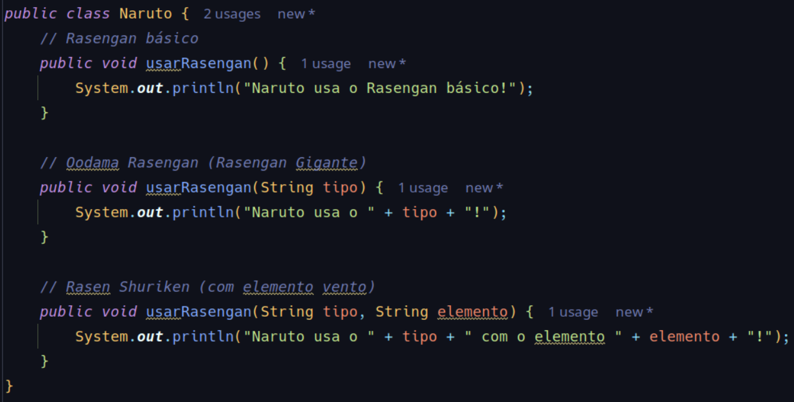
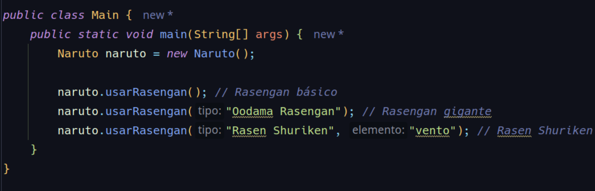

**Sobrecarga de métodos**

A _sobrecarga de métodos_ (ou method overloading) ocorre quando você define __múltiplos
métodos com o mesmo nome__ dentro de uma mesma classe, mas com __assinaturas diferentes__.
A assinatura de um método é composta pelo seu nome e pelos parâmetros (tipo, número e ordem).

**Metáfora: Sobrecarga de Métodos: O Rasengan**

Imagine que os métodos são como os jutsus (técnicas ninja) que os personagens usam. 
O mesmo jutsu pode ser executado de formas diferentes dependendo da situação, do oponente 
ou da quantidade de chakra disponível.

O Rasengan é um ótimo exemplo de sobrecarga de métodos. É uma técnica que tem o mesmo nome, 
mas pode ser usada de formas diferentes dependendo de como é executada (parâmetros). 
Veja como isso se aplica:

- Rasengan Básico: Naruto usa o Rasengan normal, que é pequeno e eficiente para combates 
corpo a corpo.
- Oodama Rasengan (Rasengan Gigante): Naruto usa mais chakra para criar um Rasengan muito maior,
causando mais dano.
- Rasen Shuriken: Naruto combina o Rasengan com o elemento vento, criando uma versão ainda
mais poderosa e destrutiva.

Embora todas essas técnicas sejam chamadas de "Rasengan", elas têm assinaturas diferentes
(quantidade de chakra, elementos combinados, etc.), assim como na sobrecarga de métodos.

Exemplo de código:

Uso:

Como o Java Escolhe o Método?

Assim como Naruto escolhe qual versão do Rasengan usar dependendo do oponente ou da situação, 
o Java escolhe qual método chamar com base nos parâmetros fornecidos. Se você passar:

- Nenhum parâmetro: Ele usa o Rasengan básico.
- Um parâmetro: Ele usa o Oodama Rasengan.
- Dois parâmetros: Ele usa o Rasen Shuriken.

**Por Que Isso é Importante?**

Assim como Naruto adapta suas técnicas para diferentes situações, a sobrecarga de métodos permite 
que você use o mesmo nome de método para lidar com diferentes tipos de dados ou cenários. 
Isso torna o código mais flexível, reutilizável e organizado.

**Resumo:**

- Sobrecarga de métodos é como o Rasengan: o mesmo nome, mas diferentes formas de execução.
- O Java escolhe o método correto com base nos "parâmetros" (como Naruto escolhe o Rasengan certo com base no oponente).
- Isso torna o código mais eficiente, assim como Naruto se torna mais versátil em combate.

