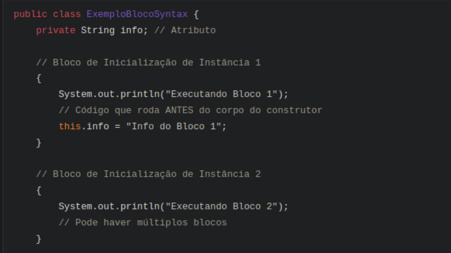
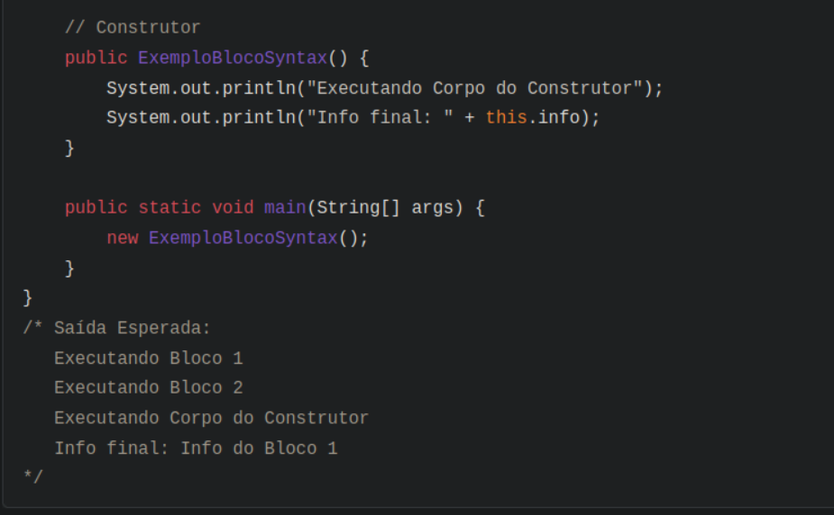
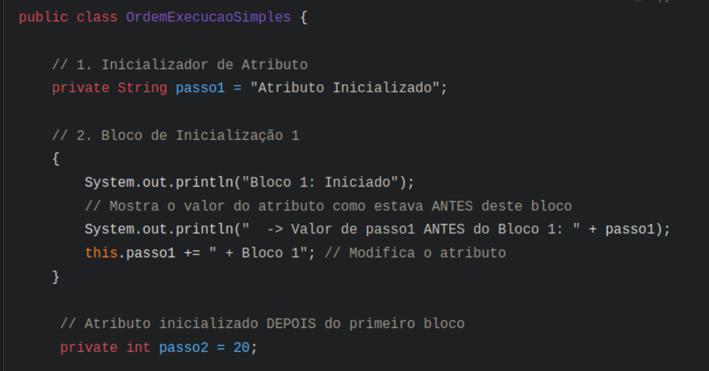
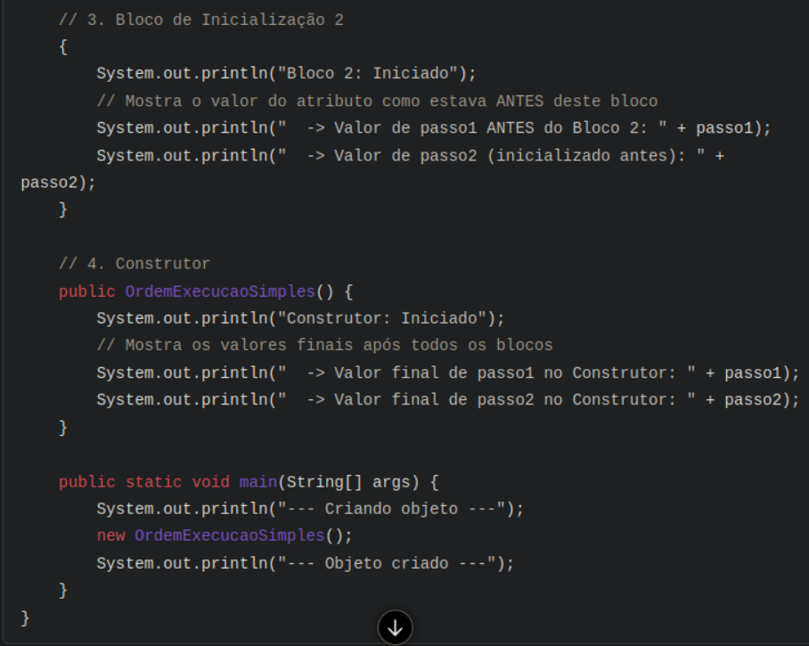

__BLOCO DE INICIALIZACÃO DE INSTÂNCIA:__

__1. O Contexto: A Criação de Objetos__

Como vimos, os Construtores são métodos especiais invocados com new para configurar
o estado inicial de um objeto. Exploramos a Sobrecarga de Construtores para ter 
múltiplas formas de criar um objeto e o uso de this(...) para encadear construtores,
reutilizando lógica e definindo um construtor "principal".

A questão que os Blocos de Inicialização respondem é: E se houver uma lógica de 
inicialização que precisa acontecer toda vez que um objeto é criado, antes mesmo 
da execução do corpo do construtor específico que foi chamado? E se essa lógica 
for comum a todos os construtores?

__2. Introduzindo os Blocos de Inicialização__

Blocos de Inicialização são segmentos de código { ... } colocados diretamente 
dentro da definição da classe, fora de qualquer método ou construtor. Eles servem
especificamente para executar código durante o processo de inicialização. Existem
dois tipos:

- Blocos de Inicialização de Instância: Executados cada vez que uma nova instância
(objeto) da classe é criada. São o foco principal aqui, pois estão diretamente 
ligados à inicialização de objetos individuais.
- Blocos de Inicialização Estáticos: Marcados com static { ... },
são executados apenas uma vez, quando a classe é carregada pela primeira
vez na JVM. Servem para inicializar membros estáticos.

__3. Foco nos Blocos de Inicialização de Instância__

**Sintaxe**: É a simplicidade em si: apenas um par de chaves { } 
contendo código Java válido, posicionado no corpo da classe.

Propósito: Agrupar código de inicialização comum a todos os construtores, 
executado antes da lógica específica de cada um. Útil para setup que não 
depende dos parâmetros do construtor.

__4. A Ordem de Execução: O Detalhe Fundamental__

Ao fazer new Classe(...), a sequência é:

- Alocação e Valores Padrão: Memória alocada, atributos com valores padrão 
(0, false, null).
- Construtor da Superclasse: Código da classe pai executa.
- Inicializadores de Atributos: Inicializações na declaração (ex: int x = 10;) 
executam na ordem em que aparecem.
- Blocos de Inicialização de Instância: Todos os blocos { ... } executam, na ordem
em que aparecem.
- Corpo do Construtor: Código do construtor chamado executa.

**Resumo da Ordem para a Instância:**
Superclasse -> Inicializadores de Atributos -> Blocos de Instância -> Corpo do Construtor.

**5. Contraste Rápido: Blocos Estáticos**
- Sintaxe: static { ... }
- Execução: Uma vez, quando a classe carrega, antes de tudo.
- Propósito: Inicializar membros static.

__Ordem Geral Completa:__
Blocos Estáticos (1ª vez) -> [Para cada new: Superclasse -> Inicializadores Atributos -> Blocos Instância -> Corpo Construtor]

**6. Por Que Usar Blocos de Inicialização de Instância?**

- Garantia de Execução Pré-Construtor: Código comum roda antes de qualquer construtor,
sem depender de this() ou repetição.
- Inicialização Complexa: Se inicializar um atributo exige lógica (loops, try-catch),
um bloco pode ser mais limpo que colocar isso em todos os construtores.
- Organização: Separa setup comum da lógica específica do construtor.
- Classes Anônimas: Essenciais para inicializar classes anônimas 
(que não têm construtores explícitos).

__7. Exemplo Prático Simplificado (Ordem de Execução)__

Vamos usar uma classe simples para ver a ordem claramente:

Saída Esperada:

--- Criando objeto --- 
Bloco 1: Iniciado 
-> Valor de passo1 ANTES do Bloco 1: Atributo Inicializado 
Bloco 2: Iniciado 
-> Valor de passo1 ANTES do Bloco 2: Atributo Inicializado + Bloco 1 
-> Valor de passo2 (inicializado antes): 20 
Construtor: Iniciado 
-> Valor final de passo1 no Construtor: Atributo Inicializado + Bloco 1 
-> Valor final de passo2 no Construtor: 20 
--- Objeto criado ---

Análise da Saída:

1. passo1 é inicializado ("Atributo Inicializado").
2. Bloco 1 executa, imprime o valor de passo1 e o modifica.
3. passo2 é inicializado (valendo 20).
4. Bloco 2 executa, imprimindo os valores atuais de passo1 (já modificado pelo Bloco 1) e passo2.
5. O Construtor executa por último, mostrando os valores finais. Isso confirma a ordem: Inicializadores e Blocos rodam na ordem em que aparecem, antes do corpo do construtor.

__8. Conclusão: Dominando a Inicialização__

Blocos de Inicialização de Instância {...} são uma ferramenta para executar código comum antes do corpo do construtor. São úteis para setup que não depende de parâmetros ou para organizar inicializações complexas. A chave é lembrar a ordem de execução: Superclasse -> Inicializadores de Atributos -> Blocos de Instância -> Corpo do Construtor. Compreender isso ajuda a criar classes com inicialização clara e correta.

