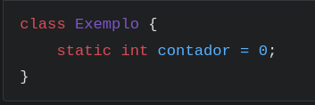
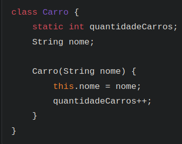
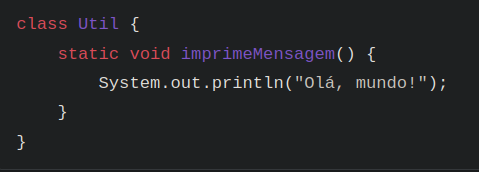

Modificador __static__

O modificador __static__ em Java é utilizado para indicar que um
atributo ou método pertence à classe, e não a uma instância específica dela.
Ou seja, membros estáticos são compartilhados entre todos os objetos daquela classe.

__Diferença entre membros estáticos e de instância__
Quando declaramos um atributo ou método como estático, ele pode ser acessado
sem precisar ciar um objeto da classe. Por exemplo:

Onde o __contador__ pode ser acessado da seguinte maneira: Exemplo.contador.
Já um atributo de instância sempre precisará de um objeto.

__Quando usar__ static:
Devemos usar static quando o valor ou comportamento não dependem de um objeto
específico, mas sim da classe como um todo. Exemplos clássicos são constantes
(public static final) e métodos utilitátios, como os da classe Math (Math.abs(),
Math.pow(), etc).

__Exemplo prático__:
Se quisermos saber quantos objetos de uma classe foram instanciados, basta usarmos
um atributo static para contar:

Cada vez que um novo carro é criado, quantidadeCarros é incrementado (quantidadeCarros++).
Esse valor é compartilhado entre todos os objetos da classe Carro.

__Métodos static__

Métodos static só podem acessar outros membros static da classe. Eles não podem
acessar atributos ou métodos de instância diretamente, pois não existe um objeto
static específico associado ao método static.

Chamamos assim: Util.imprimeMensagem();

__Ponto de atenção!__
- Não use static para tudo! Só use quando realmente fizer sentido que o atributo
ou método pertença à classe, e não ao objeto
- Métodos static não podem acessar diretamente membros de instância.